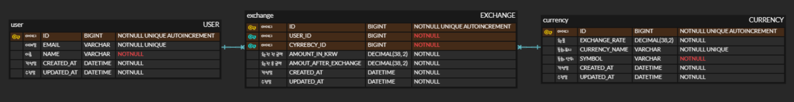

# CURRENCY_USER
---
## 🛠️ Tools :      
---
## 👨‍💻 Period : 2024/11/26 ~ 2024/11/29
---
## 👨‍💻 ERD
---

---
## 👨‍💻 API명세서
| 기능             | Method | URL                             | request param             | request body                                                                         | response body                                                                                                         | 상태코드     | 
|----------------|--------|---------------------------------|---------------------------|--------------------------------------------------------------------------------------|-----------------------------------------------------------------------------------------------------------------------|----------| 
| 환율 정보 생성       | POST   | /currencies                     |                           | {currencyName : String, exchangeRate : BigDecimal, symbol : String, round : Integer} | {id : long, currnecyName : String, exchangeRate : BigDecimal, symbol : String}                                        | 200: OK  |
| 전체 환율 조회       | GET    | /currencies                     |                           |                                                                                      | \[ {id : long, currnecyName : String, exchangeRate : BigDecimal, symbol : String} \]                                  | 200: OK  |
| 선택 환율 조회       | GET    | /currencies/{id}                | currencyId = {currencyId} |                                                                                      | {id : long, currnecyName : String, exchangeRate : BigDecimal, symbol : String}                                        | 200: OK  |
| 선택 환율 수정       | PATCH  | /currencies                     |                           | {currencyName : String, exchangeRate : BigDecimal, symbol : String, round : Integer} | {id : long, currnecyName : String, exchangeRate : BigDecimal, symbol : String}                                        | 200: OK  |
| 유저 생성          | POST   | /users                          |                           | { name : String, email : String}                                                     | {id : long, name : String, email : String}                                                                            | 200: OK  |
| 유저 전체 조회       | GET    | /users                          |                           |                                                                                      | \[ {id : long, name : String, email : String} \]                                                                      | 200: OK  | 
| 유저 단일 조회       | GET    | /users/{id}                     | userId = {userId}         |                                                                                      | {id : long, name : String, email : String}                                                                            | 200: OK  |
| 유저 삭제          | DELETE | /users/{id}                     | userId = {userId}         |                                                                                      | {message = "정상적으로 삭제되었습니다."}                                                                                          | 200: OK  |
| 환전 신청          | POST   | /exchanges                      |                           | { userId : Long, currencyId : Long, amountIn : BigDecimal }                          | { userName : String, amountIn : BigDecimal, amountOut : BigDecimal, symbol : String, status : CurrencyStatus }        | 200: OK |
| 환전 신청 전체 조회 | GET    | /exchanges                      |                           |                                                                                      | \[ { userName : String, amountIn : BigDecimal, amountOut : BigDecimal, symbol : String, status : CurrencyStatus } \]  |200: OK |
| 환전 신청 단건 조회  | GET    | /exchanges/user/{userId}        | userId = {userId}         |                                                                                      | { userName : String, amountIn : BigDecimal, amountOut : BigDecimal, symbol : String, status : CurrencyStatus }        |200: OK |
| 환전 신청 통합 조회   | GET    | /exchanges/user/{userId}/group  | userId = {userId}         |                                                                                      | \[ { currencyName : String, count : Long, totalAmountInKrw : BigDecimal } \]                                          |200: OK |
| 환전 상태 변경       | PATCH  | /exchanges                      |                           | { exchangeId : Long, userId : Long }                                                 | { userName : String, amountIn : BigDecimal, amountOut : BigDecimal, symbol : String, status : CurrencyStatus }        |200: OK |

---
## 👨‍💻 About Project

- 일본, 인도네시아 등 4개의 국가가 다른 국가와 다르게 100원 단위이기 때문에 단위에 관한 처리를 해주었습니다.
---
## 🥵 Trouble Shooting & 🚀 Refactoring
**ENUM**
- 국가 코드를 enum으로 관리하고 싶었지만 enum으로 관리를 하게 된다면 currency의 save를 이용할 수 없어서 사용하지 못한 것이 아쉽습니다.

**EXCHANGE**
- 국가별 소숫점의 단위를 자동화 하고 싶었지만 하드코딩이외의 방법을 찾을 수가 없어서 currency를 입력받을 때, 소수 자리수를 입력받는 방법으로 개선했습니다. 

---
## 😭 아쉬운점
- JPQL의 다양한 사용을 해보지 못한 것이 아쉬웠습니다.
